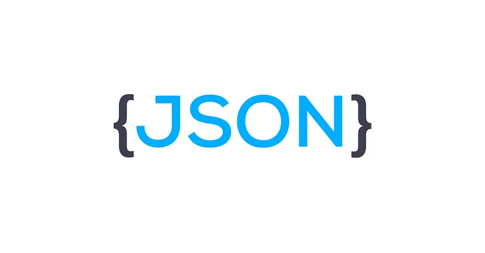

#  Contact-App

This project is a simple Contact Management Application built using ReactJS.  
It was created to explore and understand key React concepts like:
- Hooks: Managing state and side effects.
- Props: Passing data between components.

## Features
- Add, update and delete contacts.
- View list of all saved contacts.
- **Search bar**: Users can search for contacts. If the search term matches any contact's name, it will be filtered and displayed.

## Tools and Technologies:
-  **ReactJS**: For front-end development.
-  **JSON Server**: For simulating a backend API.
-  **JavaScript**: To write the app’s logic and functionalities.
-  **VSCode**: For writing the code and development environment.
-  **HTML/CSS**: For structuring and styling the components.
